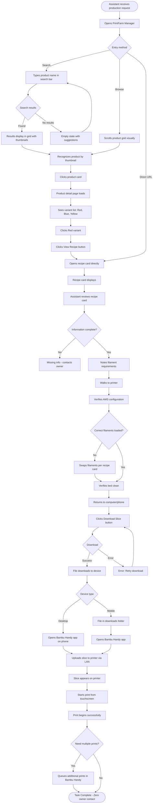

```mermaid
graph TD
    Start([Owner purchases model files]) --> A[Navigate to Upload Zip]
    A --> B[Drag zip file into upload zone]
    B --> C{Upload processing}
    C -->|Success| D[System extracts files recursively]
    C -->|Error| E[Error: Show message, allow retry]
    E --> B

    D --> F[Display all discovered files with thumbnails]
    F --> G[Owner reviews and deselects unwanted files]
    G --> H[Click Import Selected Files]
    H --> I{Import to R2}
    I -->|Success| J[Success confirmation with imported models]
    I -->|Error| E

    J --> K[Owner browses imported models in grid]
    K --> L[Finds Baby Whale model]
    L --> M[Downloads STL file]
    M --> N[Opens Bambu Studio external slicer]
    N --> O[Configures settings and generates slice]
    O --> P[Returns to PrintFarm Manager]

    P --> Q[Navigates to Baby Whale model detail]
    Q --> R[Clicks Upload Slice button]
    R --> S[Selects gcode.3mf file]
    S --> T{Metadata extraction}
    T -->|Success| U[Wizard displays extracted data]
    T -->|Missing config| V[Warning: Skip extraction, manual entry]
    T -->|Malformed JSON| W[Error: Cannot process file]
    W --> R

    U --> X[Smart filament matching runs]
    X --> Y{Match found?}
    Y -->|Yes| Z[Filament auto-selected with checkmark]
    Y -->|No| AA[Inline filament creation form]
    AA --> AB[Owner confirms/edits filament data]
    AB --> AC[Create new filament record]
    AC --> Z

    Z --> AD[Owner reviews extracted metadata]
    AD --> AE[Clicks Continue to Product Creation]
    AE --> AF[Wizard: Product creation step]
    AF --> AG[Owner enters product name: Baby Whale]
    AG --> AH[Creates variant: Red]
    AH --> AI[Sets quantity-per-print: 1]
    AI --> AJ[Thumbnail preview from gcode]
    AJ --> AK[Clicks Create Product]
    AK --> AL{Create entities}
    AL -->|Success| AM[Success confirmation with recipe card link]
    AL -->|Error| AN[Error: Show message, preserve form data]
    AN --> AF

    AM --> AO[Owner clicks recipe card link]
    AO --> AP[Recipe card displays with all info]
    AP --> AQ[Owner shares URL with assistant via Slack]
    AQ --> End([Setup Complete])
```

```mermaid
graph TD
    Start([Owner identifies demand for blue variant]) --> A[Opens Bambu Studio slicer]
    A --> B{Has model file?}
    B -->|Yes| C[Loads Baby Whale STL]
    B -->|No| D[Downloads from PrintFarm Manager]
    D --> C

    C --> E[Configures same settings as Red variant]
    E --> F[Changes filament: Blue PLA in Slot 2]
    F --> G[Generates slice file]
    G --> H[Saves as baby-whale-blue.gcode.3mf]

    H --> I[Opens PrintFarm Manager]
    I --> J[Navigates to Baby Whale product detail]
    J --> K[Clicks Add Slice button]
    K --> L[Uploads baby-whale-blue.gcode.3mf]
    L --> M{Metadata extraction}
    M -->|Success| N[Wizard displays extracted data]
    M -->|Error| O[Manual entry fallback]

    N --> P[Filament: Blue PLA, Slot 2 extracted]
    P --> Q{Smart matching}
    Q -->|Match found| R[Blue PLA auto-selected]
    Q -->|No match| S[Inline filament creation]
    S --> T[Owner enters: Brand=Bambu Lab, Color=#0086D6]
    T --> U[Material=PLA, Type=Basic]
    U --> V[System creates new filament record]
    V --> R

    R --> W[Wizard confirms: Blue PLA - Slot 2]
    W --> X[Owner clicks Continue]
    X --> Y[Wizard: Variant selection step]
    Y --> Z{Variant choice}
    Z -->|Create New| AA[Owner chooses Create New Variant]
    Z -->|Replace Existing| AB[Would update existing variant]

    AA --> AC[Enters variant name: Blue]
    AC --> AD[Sets quantity-per-print: 1]
    AD --> AE[Thumbnail extracted from gcode shows blue]
    AE --> AF[Clicks Save Variant]
    AF --> AG{Create variant}
    AG -->|Success| AH[Success confirmation]
    AG -->|Error| AI[Error: Name conflict or validation]
    AI --> AC

    AH --> AJ[Returns to product detail]
    AJ --> AK[Product now shows two variants]
    AK --> AL[Variant 1: Red - Slot 1, Red PLA]
    AL --> AM[Variant 2: Blue - Slot 2, Blue PLA]
    AM --> AN[Each has independent recipe card]
    AN --> AO[Owner verifies both recipes accessible]
    AO --> End([Variant addition complete])
```

# printfarm-manager UX/UI Specification

_Generated on 2025-10-15 by Taylor_

## Executive Summary

**PrintFarm Manager** is a web-based recipe repository system designed to transform 3D print farm operations from manual, owner-dependent chaos into systematic, reproducible manufacturing. The UX design prioritizes **visual-first navigation** and **zero-friction workflows** to enable assistants with minimal technical skills to operate independently.

**Core User Challenge:** Assistants need to find products, understand exact print configurations (filaments + AMS slots), and execute prints without owner intervention. Owner needs to quickly upload models/slices and have metadata automatically extracted to create permanent "recipes."

**UX Strategy:**
- Large thumbnails as primary navigation (users recognize products visually, not by name)
- Automated metadata extraction eliminates manual data entry
- Recipe cards provide complete, simple instructions optimized for mobile reference at the printer
- Desktop-optimized upload workflows with drag-and-drop and bulk operations
- Progressive disclosure keeps interface simple while providing power-user access to complete metadata

**Target Platforms:**
- **Primary:** Desktop browsers (Chrome, Firefox) for file upload and management workflows
- **Secondary:** Mobile/tablet for recipe card reference and catalog browsing at the printer
- **Responsive Design:** Mobile-first CSS ensures all interfaces work everywhere, optimized for primary use case per context

**Success Criteria:** Assistant can find product, access recipe, and start print in ≤5 minutes without asking owner any questions. Owner can upload zip file and create product with recipe in ≤10 minutes with <3 clicks per workflow.

---

## 1. UX Goals and Principles

### 1.1 Target User Personas

**Primary Persona: Taylor (Print Farm Owner)**

**Demographics:**
- Solo entrepreneur running 3D print farm business
- High technical proficiency with 3D printing (slicing, file formats, printer configuration)
- Works remotely and needs to manage operations from anywhere

**Goals:**
- Eliminate hours wasted weekly on redundant reslicing
- Enable delegation so business isn't owner-dependent
- Scale product catalog without proportionally scaling operational overhead
- Make production decisions remotely without direct file access

**Pain Points:**
- Files scattered across folders and drives - can't find original slices
- Mental tracking of configurations fails as catalog grows
- Constant availability required to answer assistant questions
- Reslicing waste: same models resliced repeatedly when gcode files are lost

**Technology Comfort:** High - comfortable with complex software, file systems, command-line tools

**Primary Workflows:** Upload models (zip files), upload slices, create products, metadata extraction review, filament management

**Device Context:** Desktop/laptop for management tasks, mobile for remote monitoring

---

**Secondary Persona: Print Farm Assistant**

**Demographics:**
- Family member assisting with production operations
- Minimal technical skill - not proficient with slicing software or file management
- Works on-site at print farm location

**Goals:**
- Execute print jobs independently without owner intervention
- Avoid mistakes that waste filament and printer time
- Complete prints quickly without waiting for owner responses
- Feel confident in decision-making

**Pain Points:**
- Completely blocked when owner unavailable
- Constant questions: "Which file?" "What settings?" "Which color where?"
- Uncertainty leads to errors and failed prints
- No access to configuration information

**Technology Comfort:** Low - needs simple, clear instructions, minimal technical interface

**Primary Workflows:** Browse products, search catalog, view recipe cards, download slice files

**Device Context:** Mobile/tablet at the printer, occasional desktop use for browsing

### 1.2 Usability Goals

**1. Assistant Autonomy (Critical)**
- **Goal:** 100% of reprints executed without owner intervention
- **Measurement:** Percentage of print operations completed independently
- **Success:** Assistant can find product, access recipe, and start print in ≤5 minutes without asking any questions
- **Design Focus:** Recipe cards must be self-contained with all information needed (filaments, AMS slots, settings, download button)

**2. Eliminate Reslicing Waste**
- **Goal:** 95% reduction in reslicing activities
- **Measurement:** Track reslicing events vs. recipe reuse
- **Success:** Owner never reslices existing products - always reuses saved recipes
- **Design Focus:** Make recipe retrieval faster and easier than reslicing from scratch

**3. Visual Recognition Speed**
- **Goal:** Users identify target product in <10 seconds by visual scanning
- **Measurement:** Time from landing page to product selection
- **Success:** Thumbnails enable instant recognition without reading names
- **Design Focus:** Large, high-quality thumbnails as primary navigation element

**4. Zero-Friction Uploads**
- **Goal:** <3 clicks from file selection to upload completion
- **Measurement:** Click count and user satisfaction
- **Success:** Drag-and-drop anywhere, auto-extraction, pre-populated forms
- **Design Focus:** Minimize manual data entry through automation

**5. Error Prevention and Recovery**
- **Goal:** Users self-recover from 90% of errors without external help
- **Measurement:** Support requests and error completion rates
- **Success:** Descriptive error messages with actionable guidance
- **Design Focus:** Clear feedback, preserve form data on errors, helpful error messages

**6. Mobile Reference Usability**
- **Goal:** Recipe cards fully functional on mobile at the printer
- **Measurement:** Mobile task completion rates
- **Success:** Can read recipe, download file, and reference settings on phone/tablet
- **Design Focus:** Mobile-optimized recipe cards with large touch targets

### 1.3 Design Principles

**Principle 1: Visual-First Navigation**
> "Thumbnails are the primary navigation mechanism, supplemented by clear product names."

Users recognize products by appearance, not names. Large, high-quality thumbnails enable instant recognition. Grid layouts dominate list views. Text search complements, never replaces, visual browsing.

**Principle 2: Zero-Friction Uploads**
> "File uploads should feel instant and require minimal interaction."

Drag-and-drop anywhere. Auto-extract all metadata. Pre-populate forms with extracted data. Only ask users for missing critical information. Every form field eliminated is a win.

**Principle 3: Immediate Feedback, Always**
> "Every user action receives instant visual acknowledgment."

Button states change on click. Toast notifications for success/error. Inline validation appears immediately. Progress indicators for operations >3 seconds. Users always know what's happening.

**Principle 4: Errors Are Helpful, Not Punishing**
> "Error messages explain what went wrong AND suggest how to fix it."

Descriptive language, not technical jargon. Actionable guidance with retry buttons. Preserve form data on errors. Contextual help inline. Never show stack traces to users.

**Principle 5: Progressive Disclosure of Complexity**
> "Show simple by default, reveal complexity on demand."

Recipe cards show curated settings (layer height, temp, filament). Advanced users can toggle "Show All Metadata." Primary interface never overwhelms. Power features accessible but not prominent.

**Principle 6: Defaults That Make Sense**
> "Pre-select the most common choice to reduce decision fatigue."

Metadata extraction pre-fills forms. Thumbnails default to first extracted image. Quantity-per-print defaults to 1. Users confirm rather than configure from scratch 80% of the time.

---

## 2. Information Architecture

### 2.1 Site Map

```
printfarm-manager/
│
├── Home (Product Catalog)
│   ├── Product Grid View (default)
│   ├── Search Bar (always visible)
│   └── Filters (collapsed by default)
│
├── Products
│   ├── Product List/Grid
│   ├── Product Detail
│   │   ├── Variant List
│   │   ├── Associated Slices
│   │   └── Add New Variant
│   └── Create New Product
│
├── Models
│   ├── Model List/Grid
│   ├── Model Detail
│   │   ├── Associated Slices
│   │   ├── Associated Products
│   │   └── Upload Slice for Model
│   ├── Upload Model (Individual)
│   ├── Upload Zip File
│   │   └── File Selection & Import
│   └── Needs Slicing List
│
├── Slices
│   ├── Slice List/Grid
│   ├── Slice Detail
│   │   ├── Metadata Display (curated)
│   │   ├── Show All Metadata (toggle)
│   │   ├── Associated Models
│   │   ├── Associated Products/Variants
│   │   └── Download Slice
│   └── Upload Slice
│       └── Metadata Extraction Wizard
│           ├── Step 1: Filament Matching/Creation
│           ├── Step 2: Model Association
│           └── Step 3: Product/Variant Creation
│
├── Filaments
│   ├── Filament List (color swatches)
│   ├── Filament Detail
│   │   ├── Usage Information (slices using this filament)
│   │   └── Reassign Slices (if deleted)
│   ├── Create New Filament
│   └── Edit Filament
│
├── Recipe Cards (Public)
│   └── /recipe/:uuid
│       ├── Product Thumbnail
│       ├── Filament Requirements (AMS slots)
│       ├── Curated Settings
│       ├── Download Slice Button
│       └── Print Time/Material Info
│
└── Admin/Utility
    ├── Storage Dashboard (/admin/storage)
    └── Environment Indicator (footer, all pages)
```

**Hierarchy Notes:**
- **Flat structure** - maximum 2-3 clicks to reach any destination
- **Entity-centric organization** - Products, Models, Slices, Filaments as top-level sections
- **Recipe cards** - Separate public URL space, standalone interface
- **Upload workflows** - Embedded within relevant sections (Models, Slices)
- **Needs Slicing** - Special view under Models section

### 2.2 Navigation Structure

**Primary Navigation (Top Navigation Bar)**

```
┌─────────────────────────────────────────────────────────────────┐
│ [PrintFarm Manager Logo]  [Search Bar - Always Visible]         │
│                                                                   │
│ [Products] [Models] [Slices] [Filaments]          [+ Upload ▼]  │
└─────────────────────────────────────────────────────────────────┘
```

**Items:**
1. **Products** - Default landing page, product catalog grid
2. **Models** - Model library grid
3. **Slices** - Slice library grid
4. **Filaments** - Filament inventory list
5. **[+ Upload]** - Dropdown menu:
   - Upload Model (Individual)
   - Upload Zip File
   - Upload Slice
   - Create Product

**Navigation Behavior:**
- **Sticky header** - navigation always visible during scroll
- **Active state** - Current section highlighted
- **Search bar** - Persistent, accessible from all pages
- **Mobile collapse** - Hamburger menu on mobile, drawer navigation

---

**Secondary Navigation (Context-Specific)**

**On Product Detail Pages:**
- Breadcrumbs: `Products > Baby Whale`
- Tab navigation: `Overview | Variants | Slices | History (Phase 2)`
- Quick actions: `[Add Variant]` `[Upload Slice]` `[Edit Product]`

**On Model Detail Pages:**
- Breadcrumbs: `Models > baby-whale.stl`
- Quick actions: `[Upload Slice]` `[Mark Needs Slicing]` `[Download Model]` `[Edit]`
- Related sections: `Used in Slices (3)` `Used in Products (2)`

**On Slice Detail Pages:**
- Breadcrumbs: `Slices > baby-whale-red.gcode.3mf`
- Quick actions: `[Download Slice]` `[Link to Product]` `[Show All Metadata]`
- Related sections: `Models (2)` `Products (1)` `Filaments (2)`

**On Filament Detail Pages:**
- Breadcrumbs: `Filaments > Red PLA (Bambu Lab)`
- Quick actions: `[Edit Filament]` `[Delete]`
- Related sections: `Used in Slices (15)`

---

**Mobile Navigation Strategy**

**Hamburger Menu (≤768px):**
```
┌─────────────────────────────────┐
│ ☰  PrintFarm  [Search 🔍]       │
└─────────────────────────────────┘

[Tap ☰ reveals drawer:]
┌─────────────────────┐
│ 🏠 Products         │
│ 📦 Models           │
│ 🔪 Slices           │
│ 🎨 Filaments        │
│ ─────────────────── │
│ ➕ Upload Model     │
│ ➕ Upload Zip       │
│ ➕ Upload Slice     │
│ ➕ Create Product   │
│ ─────────────────── │
│ 📊 Storage          │
└─────────────────────┘
```

**Bottom Navigation (Alternative, Optimized for Thumb Access):**
```
┌─────────────────────────────────┐
│ [Content Area]                   │
│                                  │
└─────────────────────────────────┘
┌─────────────────────────────────┐
│ [🏠] [📦] [🔍] [🔪] [☰]         │
│ Home Models Search Slices More  │
└─────────────────────────────────┘
```

**Mobile Considerations:**
- **Recipe cards** - Mobile-first design, optimized for reference at printer
- **Search** - Prominent search icon/button, expands to full-width input
- **Upload actions** - Secondary menu (less frequent on mobile)
- **Touch targets** - Minimum 44px for comfortable tapping

---

**Breadcrumb Navigation Pattern**

Used on all detail pages for context and quick back-navigation:

```
Home > Products > Baby Whale > Red Variant > Recipe Card
       ↑ clickable links for quick navigation
```

**Rules:**
- Always show full path from home
- Each segment clickable except current page
- Truncate on mobile: `… > Baby Whale > Red Variant`
- Show entity type icons for clarity

---

**Footer Navigation (Utility Links)**

```
┌─────────────────────────────────────────────────────────┐
│ PrintFarm Manager v1.0                                   │
│ Environment: [Production 🟢] [Staging 🟡] [Dev ⚪]      │
│                                                          │
│ [Storage Dashboard] [Help Docs (Phase 2)] [Settings]   │
└─────────────────────────────────────────────────────────┘
```

**Environment Indicator:**
- Always visible in footer
- Color-coded (green=production, yellow=staging, gray=dev)
- Clickable for environment details

---

## 3. User Flows

### User Flow 1: First-Time Product Setup (Owner)

**User Goal:** Transform newly purchased model files into a reproducible recipe for inventory production

**Entry Points:**
- Homepage → Upload dropdown → Upload Zip File
- Models page → Upload Zip button

**Success Criteria:** Recipe card generated and accessible for assistant to use

**Flow Diagram:**



**Step-by-Step Actions:**

1. **Acquire & Upload Models** (5-10 minutes)
   - Owner downloads zip from designer (50-200MB)
   - Drags zip into upload zone
   - Upload progress shows percentage (2-3 minutes for large files)
   - System extracts and displays all valid files

2. **Select Files to Import** (1-2 minutes)
   - Review discovered files in grid with thumbnails
   - Deselect unwanted files (promo images, alternates)
   - Click "Import Selected Files"
   - Success confirmation

3. **Download for Slicing** (2-5 minutes)
   - Browse imported models
   - Find target model (Baby Whale)
   - Download STL file
   - External: Slice in Bambu Studio

4. **Upload Slice & Extract Metadata** (2-5 minutes)
   - Return to model detail page
   - Click "Upload Slice"
   - Select gcode.3mf file
   - Wait for extraction (5-10 seconds)
   - Wizard appears with pre-populated data

5. **Filament Matching** (30 seconds - 2 minutes)
   - System auto-matches filaments
   - If no match: inline creation with pre-filled data
   - Owner confirms filament assignments
   - AMS slot numbers preserved from metadata

6. **Create Product & Variant** (1-2 minutes)
   - Enter product name and variant
   - Set quantity-per-print
   - Thumbnail auto-selected
   - Click Create Product

7. **Verify Recipe Card** (30 seconds)
   - View generated recipe card
   - Verify all information present
   - Share URL with assistant

**Decision Points:**
- File selection: Which files to import vs. skip
- Filament matching: Accept auto-match vs. create new
- Product creation: New product vs. add variant to existing

**Error Scenarios:**
- Upload fails (connection interrupted) → Retry with preserved context
- Metadata extraction fails → Manual entry fallback
- Filament matching fails → Inline creation required
- Product name conflict → Validation error, choose different name

**Time to Complete:** 10-25 minutes (first time with new model)

---

### User Flow 2: Autonomous Reprint (Assistant)

**User Goal:** Execute production run for existing product without contacting owner

**Entry Points:**
- Homepage (default landing)
- Direct recipe card URL (bookmarked or from Slack)

**Success Criteria:** Print started successfully with correct configuration in ≤5 minutes

**Flow Diagram:**



**Step-by-Step Actions:**

1. **Receive Request & Open System** (30 seconds)
   - Message: "Need 3 Baby Whales (Red) for tomorrow"
   - Opens PrintFarm Manager (no login required)
   - System loads homepage with product grid

2. **Find Product** (30 seconds - 1 minute)
   - **Option A - Search:** Types "whale" in search bar
     - Results appear in <1 second
     - Product card visible with thumbnail
   - **Option B - Visual Browse:** Scrolls grid
     - Recognizes product by thumbnail image
   - **Option C - Direct URL:** Opens bookmarked recipe link
     - Bypasses search entirely

3. **Access Recipe Card** (30 seconds)
   - Clicks product card → Product detail
   - Sees variant list (Red, Blue, Yellow)
   - Clicks "Red" variant
   - Clicks "View Recipe" button
   - Recipe card loads in <2 seconds

4. **Review Recipe Information** (1 minute)
   - Large thumbnail of red baby whale visible
   - Filament requirements clearly displayed:
     - "Load Red PLA (Bambu Lab) into AMS Slot 1"
   - Print settings visible at a glance
   - Estimated time: 3h 45min per print
   - Assistant mentally notes requirements

5. **Prepare Printer** (1-2 minutes)
   - Walks to printer location
   - Checks AMS slot 1
   - Discovers wrong filament (Blue PLA currently loaded)
   - Swaps filament: removes Blue, loads Red into Slot 1
   - Verifies bed is clean and ready

6. **Download Slice** (30 seconds)
   - Returns to computer/phone
   - Clicks "Download Slice" button on recipe card
   - File downloads: baby-whale-red.gcode.3mf (15MB, ~5 seconds)
   - File appears in downloads folder

7. **Upload to Printer & Start** (1-2 minutes)
   - Opens Bambu Handy app on phone
   - Uploads slice to printer via LAN
   - Navigates to printer touchscreen
   - Starts print from queue
   - Print begins successfully

8. **Queue Additional Prints** (1 minute, if needed)
   - For 3 total whales, assistant queues remaining 2 prints
   - Uses Bambu Handy to manage queue
   - All 3 prints scheduled

**Total Time: 4-6 minutes from request to first print started**

**Decision Points:**
- Search vs. browse vs. direct URL (assistant choice based on familiarity)
- Which variant to print (based on production request)
- Filament swap needed? (based on current AMS state)
- How many prints to queue (based on production quantity)

**Error Scenarios:**
- Product not found in search → Try alternate spelling or browse visually
- Recipe card missing information → Contact owner (edge case, shouldn't happen)
- Download fails → Retry button available
- Printer offline → Physical printer issue, unrelated to system

**Success Metrics:**
- ✓ Found product in <30 seconds
- ✓ Identified correct filament/slot configuration without confusion
- ✓ Started print in <5 minutes from request
- ✓ Zero questions asked to owner

**Owner Intervention Required:** None - Fully autonomous execution

---

### User Flow 3: New Variant Addition (Owner)

**User Goal:** Add new color variant to existing product without disrupting existing variants

**Entry Points:**
- Product detail page → Add Variant button
- Model detail page → Upload Slice → Link to existing product

**Success Criteria:** New variant recipe available alongside existing variants

**Flow Diagram:**



**Step-by-Step Actions:**

1. **Decide & Prepare** (2-5 minutes)
   - Identify customer demand for blue variant
   - Confirm base model already uploaded
   - Open Bambu Studio slicer
   - Load existing Baby Whale STL (download if needed)

2. **Create New Slice Configuration** (5-10 minutes)
   - Use same settings as Red variant (0.16mm, supports)
   - Change filament configuration: Blue PLA (Slot 2) instead of Red (Slot 1)
   - Generate slice file
   - Save as baby-whale-blue.gcode.3mf

3. **Navigate to Product** (30 seconds)
   - Open PrintFarm Manager
   - Navigate to Baby Whale product detail page
   - See existing Red variant listed
   - Click "Add Slice" button

4. **Upload & Extract** (1-2 minutes)
   - Upload baby-whale-blue.gcode.3mf
   - Wait for metadata extraction (5-10 seconds)
   - Wizard appears with extracted data

5. **Handle Filament Matching** (1-3 minutes)
   - Wizard displays: "Filament: Blue PLA, Bambu Lab (AMS Slot 2)"
   - **Scenario A - Match Found:**
     - Blue PLA record exists in database
     - System auto-selects with green checkmark
     - Owner confirms and continues
   - **Scenario B - No Match:**
     - No blue filament record exists
     - Inline creation form appears
     - Pre-filled: Brand="Bambu Lab", Color=#0086D6, Material="PLA", Type="Basic"
     - Owner confirms/edits data
     - Clicks "Create Filament"
     - New record created with exact metadata match

6. **Create New Variant** (1 minute)
   - Wizard advances to variant selection
   - Owner chooses "Create New Variant" (not replace existing)
   - Enters variant name: "Blue"
   - Sets quantity-per-print: 1 (same as Red)
   - Thumbnail preview shows blue whale (extracted from gcode)
   - Clicks "Save Variant"

7. **Verify Multi-Variant Product** (30 seconds)
   - Product detail page refreshes
   - Now displays:
     - Product: "Baby Whale"
     - Variant 1: "Red" → Recipe: Red PLA, Slot 1
     - Variant 2: "Blue" → Recipe: Blue PLA, Slot 2
   - Each variant has independent recipe card link
   - Search for "whale" returns single product card with 2 variants shown

**Total Time: 10-20 minutes**

**Decision Points:**
- Create new variant vs. replace existing variant
- Accept filament auto-match vs. inline creation
- Variant naming convention

**Error Scenarios:**
- Filament matching fails → Inline creation resolves
- Variant name conflict → Validation error, choose different name
- Metadata extraction fails → Manual entry fallback
- Upload fails → Retry with preserved state

**Key Benefits:**
- Same base model reused across variants (no duplicate uploads)
- Different slice configurations coexist without conflict
- Assistant can independently produce either color without confusion
- Product catalog stays organized (variants grouped under single product)

**Edge Cases Handled:**
- Filament matching fails → Inline creation prevents workflow blocking
- Variants can share slices OR have unique slices (flexible many-to-many)
- Thumbnails automatically extracted, fallback to product thumbnail if needed
- Non-contiguous AMS slots supported (e.g., Slot 1 and Slot 3, skipping Slot 2)

{{user_flow_4}}

{{user_flow_5}}

---

## 4. Component Library and Design System

### 4.1 Design System Approach

**Strategy: Custom Component Library Built on React Aria Components**

**Foundation:**
- **React Aria Components** - Headless, accessible component primitives from Adobe
- **TailwindCSS** - Utility-first styling with custom theme configuration
- **No Third-Party UI Library** - Custom components provide full design control

**Rationale:**
- React Aria provides baseline accessibility (ARIA attributes, keyboard navigation, screen reader support) without prescribing visual design
- TailwindCSS enables rapid custom styling without CSS-in-JS overhead
- Custom components align perfectly with specific workflow requirements (metadata wizard, recipe cards, file upload zones)
- Avoids bloat from unused components in libraries like Material UI or Ant Design
- Full control over component behavior matches unique business logic (metadata extraction, filament matching)

**Component Architecture:**

```
src/components/
├── ui/                          # Core UI primitives (React Aria based)
│   ├── Button.tsx
│   ├── Dialog.tsx
│   ├── TextField.tsx
│   ├── Select.tsx
│   ├── Checkbox.tsx
│   ├── Toast.tsx
│   └── ProgressBar.tsx
│
├── layout/                      # Layout components
│   ├── Header.tsx
│   ├── Footer.tsx
│   ├── Sidebar.tsx
│   ├── Grid.tsx               # Responsive grid for cards
│   └── Container.tsx
│
├── navigation/                  # Navigation components
│   ├── NavBar.tsx
│   ├── Breadcrumbs.tsx
│   ├── Tabs.tsx
│   └── SearchBar.tsx
│
├── cards/                       # Entity card components
│   ├── ProductCard.tsx
│   ├── ModelCard.tsx
│   ├── SliceCard.tsx
│   ├── FilamentCard.tsx
│   └── RecipeCard.tsx         # Special: mobile-optimized
│
├── upload/                      # Upload-specific components
│   ├── DropZone.tsx
│   ├── FileSelector.tsx
│   ├── UploadProgress.tsx
│   └── FilePreview.tsx
│
├── wizards/                     # Multi-step wizard components
│   ├── WizardContainer.tsx
│   ├── WizardStep.tsx
│   ├── MetadataExtractionWizard.tsx
│   └── ProductCreationWizard.tsx
│
└── domain/                      # Domain-specific components
    ├── MetadataDisplay.tsx    # Curated vs. full metadata toggle
    ├── FilamentSwatch.tsx     # Color visualization
    ├── AMSSlotIndicator.tsx   # Slot number badges
    ├── ThumbnailGallery.tsx
    └── RelationshipView.tsx   # "Used in X slices" displays
```

**Design System Benefits:**
- **Consistency:** All components follow same design language and behavior patterns
- **Accessibility:** React Aria provides foundation, we ensure full WCAG compliance
- **Performance:** Tree-shakable, only used components bundled
- **Maintainability:** Single source of truth for component behavior
- **Flexibility:** Easy to adapt components for unique workflows

**Implementation Notes:**
- Component variants controlled via TailwindCSS classes (primary, secondary, danger buttons)
- Shared theme configuration in `tailwind.config.js` (colors, spacing, typography)
- Component documentation via JSDoc comments
- Storybook (optional Phase 2) for component development and testing

### 4.2 Core Components

**1. Product Card**

**Purpose:** Display product in grid/list views with thumbnail, name, and metadata

**Variants:**
- Grid card (default): 200x200px thumbnail, product name below, variant count badge
- List card: Horizontal layout with thumbnail, name, description, metadata

**States:**
- Default: Normal appearance
- Hover: Thumbnail enlarges slightly, shadow increases, cursor pointer
- Active/Selected: Border highlight, background tint
- Loading: Skeleton placeholder while data fetches
- Error: Placeholder with error icon, retry action

**Usage Guidelines:**
- Always show thumbnail (use placeholder if none available)
- Truncate long product names with ellipsis
- Badge shows variant count: "3 variants"
- Click anywhere on card navigates to product detail

**Responsive Behavior:**
- Desktop: 4 columns (240px cards)
- Tablet: 2 columns (320px cards)
- Mobile: 1 column (full width cards)

---

**2. Recipe Card (Mobile-Optimized)**

**Purpose:** Standalone card providing complete print instructions for assistants

**Components:**
- Large product thumbnail (full width, 400px height on mobile)
- Product name + variant name (prominent header)
- Filament requirements section:
  - Each filament as card: Color swatch + Brand + Material + **AMS Slot Number**
  - Clear visual slot indicators: "Slot 1" "Slot 2" "Slot 3"
- Curated settings section (collapsible):
  - Layer height, nozzle temp, bed temp, print speed
  - Infill percentage, supports (yes/no)
  - Print time estimate, filament usage (grams)
- Download button (large, prominent, 48px height for touch)
- "Show All Metadata" toggle (advanced users)

**States:**
- Loading: Skeleton with placeholders
- Ready: All information displayed, download enabled
- Downloading: Button shows spinner, "Downloading..."
- Error: Download failed, retry button

**Mobile-Specific Optimizations:**
- Full-width layout on mobile
- Large touch targets (minimum 44px)
- Readable at arm's length (16px base font size)
- Sticky download button (always visible while scrolling)
- Landscape mode: Two-column layout (thumbnail | info)

**Usage Guidelines:**
- Recipe cards are publicly accessible (no auth required)
- UUID-based URLs prevent enumeration
- Optimized for reference at printer (mobile device)
- All information needed visible without scrolling (on tablet/mobile)

---

**3. Metadata Extraction Wizard**

**Purpose:** Multi-step wizard for slice upload with auto-extraction and product creation

**Steps:**
1. **Upload & Extract** - File upload, progress indicator, extraction status
2. **Filament Matching** - Display matched filaments with AMS slots, inline creation if needed
3. **Model Association** - Link slice to model(s), handle multi-model plates
4. **Product/Variant** - Create new or link to existing product and variant

**States per Step:**
- Pending: Step not yet reached (grayed out, disabled)
- Active: Current step (highlighted, interactive)
- Completed: Step finished (checkmark icon, can return to edit)
- Error: Step failed validation (error icon, inline error messages)

**Wizard Navigation:**
- Progress indicator at top: Step 1 → Step 2 → Step 3 → Step 4
- "Back" button (except Step 1)
- "Continue" button (validated before advancing)
- "Save Draft" option (save without completing, resume later - Phase 2)

**Usage Guidelines:**
- Wizard preserves state if user navigates away
- Pre-populated fields from metadata (minimize manual entry)
- Inline validation with immediate feedback
- Can skip product creation step (save slice without linking)

---

**4. File Upload Drop Zone**

**Purpose:** Drag-and-drop file upload with visual feedback

**States:**
- Default: Dashed border, upload icon, "Drag file here or click to browse"
- Drag Over: Solid border, highlighted background, "Drop file to upload"
- Uploading: Progress bar with percentage, "Uploading... 45%"
- Success: Checkmark icon, "Upload complete"
- Error: Error icon, descriptive message, "Retry" button

**Variants:**
- Zip file upload: Accepts .zip files, large drop zone
- Single file upload: Accepts .stl, .3mf, .gcode, .gcode.3mf, smaller drop zone
- Image upload: Accepts .png, .jpg, .jpeg, preview after upload

**Features:**
- Click to open file picker (alternative to drag-and-drop)
- File type validation (client-side)
- File size validation (client-side warning if oversized)
- Multiple file upload (for individual files, not zip)

---

**5. Search Bar**

**Purpose:** Fuzzy search across products and models, always accessible

**States:**
- Default: Empty, placeholder text "Search products and models..."
- Focused: Border highlight, cursor in field
- Typing: Debounced input (300ms), loading spinner in field
- Results: Dropdown with results grid (thumbnails + names)
- Empty Results: "No results found, try different keywords"

**Features:**
- Keyboard navigation (up/down arrows through results)
- Enter key selects highlighted result
- Escape key closes results dropdown
- Click outside closes dropdown
- Shows recent searches (Phase 2)
- Search-as-you-type with debouncing

**Responsive:**
- Desktop: Always visible in header (400px width)
- Mobile: Search icon, expands to full-width overlay on tap

---

**6. Filament Swatch**

**Purpose:** Visual representation of filament color with metadata

**Display:**
- Color circle (32px diameter) filled with hex color
- Brand name + material type
- Optional: AMS slot badge overlay

**Variants:**
- Small: 24px circle, compact text
- Medium: 32px circle (default)
- Large: 48px circle, prominent text

**States:**
- Default: Solid color fill
- Hover: Tooltip with full filament details
- Selected: Border highlight
- Deleted: Strikethrough, grayed out

---

**7. Toast Notifications**

**Purpose:** Temporary feedback messages for user actions

**Types:**
- Success: Green background, checkmark icon, "Product created successfully"
- Error: Red background, X icon, "Upload failed: Connection interrupted"
- Warning: Yellow background, warning icon, "File size exceeds recommended limit"
- Info: Blue background, info icon, "Recipe card link copied to clipboard"

**Behavior:**
- Appears top-right corner (desktop) or top-center (mobile)
- Auto-dismiss after 5 seconds (success/info) or 10 seconds (error/warning)
- Manual dismiss via X button
- Stacks multiple toasts vertically
- Slide-in animation from right (desktop) or top (mobile)

---

**8. Breadcrumbs**

**Purpose:** Show current location and enable quick navigation

**Format:** `Home > Products > Baby Whale > Red Variant`

**Features:**
- Each segment clickable except current page
- Truncate on mobile: `… > Baby Whale > Red Variant`
- Entity type icons for clarity (🏠 Home, 📦 Product, 🎨 Variant)
- Hover state: Underline
- Separator: `>` or `/`

---

**9. Skeleton Loaders**

**Purpose:** Provide visual feedback during content loading

**Patterns:**
- Card grid: Grid of skeleton cards with animated pulse
- Detail page: Skeleton layout matching actual content structure
- Text: Gray bars with varying widths
- Images: Gray rectangles with pulse animation

**Usage:**
- Show skeletons immediately while fetching data
- Replace with actual content when loaded
- Maintain layout stability (no content shift)

---

**10. Data Grid/Table (Phase 2)**

**Purpose:** Alternative view for product/model/slice lists with sortable columns

**Deferred to Phase 2:**
- MVP focuses on card/grid views (visual-first principle)
- Table view adds complexity not needed initially
- Can be added based on user feedback for power users

---

## 5. Visual Design Foundation

### 5.1 Color Palette

**Design Approach:** Professional, minimal, and functional with clear semantic meaning

**Primary Colors:**
```
Primary Blue (Actions, Links, Focus)
- 50:  #eff6ff  (Very light - backgrounds, hover states)
- 100: #dbeafe  (Light - subtle backgrounds)
- 200: #bfdbfe  (Light accent)
- 300: #93c5fd  (Medium light)
- 400: #60a5fa  (Medium)
- 500: #3b82f6  (Primary - main brand color, buttons, links)
- 600: #2563eb  (Primary dark - hover states)
- 700: #1d4ed8  (Dark - active states)
- 800: #1e40af  (Darker)
- 900: #1e3a8a  (Darkest - text on light)
```

**Neutral Grays (Structure, Text, Borders):**
```
Gray Scale
- 50:  #f9fafb  (Lightest - page backgrounds)
- 100: #f3f4f6  (Very light - card backgrounds)
- 200: #e5e7eb  (Light - borders, dividers)
- 300: #d1d5db  (Medium light - disabled states)
- 400: #9ca3af  (Medium - placeholders)
- 500: #6b7280  (Medium dark - secondary text)
- 600: #4b5563  (Dark - body text)
- 700: #374151  (Darker - headings)
- 800: #1f2937  (Very dark - primary text)
- 900: #111827  (Darkest - emphasis text)
```

**Semantic Colors:**
```
Success (Green)
- Light: #d1fae5  (Background)
- Base:  #10b981  (Icons, borders)
- Dark:  #059669  (Hover states)
- Usage: Success messages, completed states, checkmarks

Error (Red)
- Light: #fee2e2  (Background)
- Base:  #ef4444  (Icons, borders, text)
- Dark:  #dc2626  (Hover states)
- Usage: Error messages, validation errors, destructive actions

Warning (Yellow/Amber)
- Light: #fef3c7  (Background)
- Base:  #f59e0b  (Icons, borders)
- Dark:  #d97706  (Hover states)
- Usage: Warning messages, caution states, needs attention

Info (Blue)
- Light: #dbeafe  (Background)
- Base:  #3b82f6  (Icons, borders)
- Dark:  #2563eb  (Hover states)
- Usage: Informational messages, tips, helpful notes
```

**Environment Indicators:**
```
Production:  #10b981 (Green) - Safe to use
Staging:     #f59e0b (Amber)  - Testing environment
Development: #6b7280 (Gray)   - Local development
```

**Transparency Utilities:**
```
Black overlays: rgba(0, 0, 0, 0.05) → rgba(0, 0, 0, 0.75)
White overlays: rgba(255, 255, 255, 0.05) → rgba(255, 255, 255, 0.95)
```

**Usage Guidelines:**
- **Primary Blue**: Call-to-action buttons, links, focused states
- **Gray**: Structure (borders, dividers), body text, disabled states
- **Semantic colors**: Only for their intended meaning (success=green, error=red)
- **White backgrounds**: Primary surfaces (cards, modals)
- **Gray-50 backgrounds**: Page-level backgrounds
- **High contrast**: Ensure WCAG AA compliance (4.5:1 for text, 3:1 for UI elements)

### 5.2 Typography

**Font Families:**

```css
/* Primary Font: System UI Stack (Performance + Native Feel) */
font-family: -apple-system, BlinkMacSystemFont, "Segoe UI", Roboto,
             "Helvetica Neue", Arial, sans-serif,
             "Apple Color Emoji", "Segoe UI Emoji", "Segoe UI Symbol";

/* Monospace Font: For code, filenames, technical data */
font-family: "JetBrains Mono", ui-monospace, SFMono-Regular, Menlo, Monaco,
             Consolas, "Liberation Mono", "Courier New", monospace;
```

**Rationale:**
- System font stack ensures native feel on each platform
- Zero network requests for sans-serif fonts (instant load)
- Excellent readability across all devices
- JetBrains Mono for technical content (filenames, metadata, code) - superior readability for technical text with excellent ligature support and character differentiation
- Fallback to system monospace fonts if JetBrains Mono not loaded

**Font Loading Strategy:**
- JetBrains Mono loaded from Google Fonts or self-hosted
- Use `font-display: swap` for immediate text rendering with fallback
- Load only required weights (400, 500, 700) to minimize bundle size

**Type Scale:**

```
Heading 1 (Page Titles)
- Size: 36px (2.25rem)
- Weight: 700 (Bold)
- Line Height: 1.2 (43px)
- Letter Spacing: -0.02em (tighter)
- Usage: Page titles, primary headings

Heading 2 (Section Titles)
- Size: 30px (1.875rem)
- Weight: 700 (Bold)
- Line Height: 1.3 (39px)
- Letter Spacing: -0.01em
- Usage: Major sections, card titles

Heading 3 (Subsection Titles)
- Size: 24px (1.5rem)
- Weight: 600 (Semibold)
- Line Height: 1.4 (34px)
- Letter Spacing: 0
- Usage: Subsections, dialog titles

Heading 4 (Component Titles)
- Size: 20px (1.25rem)
- Weight: 600 (Semibold)
- Line Height: 1.5 (30px)
- Letter Spacing: 0
- Usage: Component headings, list headers

Heading 5 (Small Titles)
- Size: 18px (1.125rem)
- Weight: 600 (Semibold)
- Line Height: 1.5 (27px)
- Letter Spacing: 0
- Usage: Small section titles, form labels

Body Large
- Size: 18px (1.125rem)
- Weight: 400 (Regular)
- Line Height: 1.6 (29px)
- Letter Spacing: 0
- Usage: Prominent body text, introductions

Body (Default)
- Size: 16px (1rem)
- Weight: 400 (Regular)
- Line Height: 1.5 (24px)
- Letter Spacing: 0
- Usage: Default body text, descriptions, content

Body Small
- Size: 14px (0.875rem)
- Weight: 400 (Regular)
- Line Height: 1.5 (21px)
- Letter Spacing: 0
- Usage: Secondary information, metadata, captions

Caption
- Size: 12px (0.75rem)
- Weight: 400 (Regular)
- Line Height: 1.5 (18px)
- Letter Spacing: 0.02em
- Usage: Fine print, timestamps, labels

Button Text
- Size: 16px (1rem)
- Weight: 500 (Medium)
- Line Height: 1 (16px)
- Letter Spacing: 0.01em
- Usage: Button labels (slightly heavier for emphasis)

Link Text
- Size: Inherit from context
- Weight: 500 (Medium)
- Line Height: Inherit
- Color: Primary-600
- Decoration: Underline on hover
- Usage: Inline links, navigation links
```

**Responsive Typography (Mobile Adjustments):**
```
@media (max-width: 768px) {
  H1: 28px → 24px  (reduce for mobile)
  H2: 30px → 22px
  H3: 24px → 20px
  Body: 16px (unchanged - maintain readability)
}
```

**Font Weight Scale:**
- 400 (Regular): Body text, default
- 500 (Medium): Buttons, emphasized text, links
- 600 (Semibold): Headings H3-H5, strong emphasis
- 700 (Bold): Headings H1-H2, primary emphasis

**Usage Guidelines:**
- Use consistent scale (never arbitrary sizes)
- Heading hierarchy must be semantic (H1 → H2 → H3, no skipping)
- Body text minimum 16px for readability (especially mobile)
- Line height 1.5-1.6 for body text (comfortable reading)
- Tighter line height (1.2-1.3) for headings
- Monospace for filenames, technical data, code snippets

### 5.3 Spacing and Layout

**Spacing Scale (Based on 4px Base Unit)**

```
TailwindCSS spacing scale (rem values):
0:    0px
0.5:  2px   (0.125rem)  - Hairline borders
1:    4px   (0.25rem)   - Tight spacing
1.5:  6px   (0.375rem)
2:    8px   (0.5rem)    - Minimal spacing (badges, small gaps)
3:    12px  (0.75rem)   - Compact spacing
4:    16px  (1rem)      - Standard spacing (card padding, margins)
5:    20px  (1.25rem)
6:    24px  (1.5rem)    - Comfortable spacing (section gaps)
8:    32px  (2rem)      - Generous spacing (between sections)
10:   40px  (2.5rem)
12:   48px  (3rem)      - Large spacing (major sections)
16:   64px  (4rem)      - Extra large (page sections)
20:   80px  (5rem)
24:   96px  (6rem)      - Maximum spacing
```

**Layout Grid System:**

```
Desktop (≥1024px):
- Container max-width: 1280px
- Columns: 12-column grid
- Gutter: 24px (6)
- Margin: 32px (8) each side
- Product cards: 4 columns (240px each + gutters)

Tablet (768px - 1023px):
- Container max-width: 768px
- Columns: 8-column grid
- Gutter: 20px (5)
- Margin: 24px (6) each side
- Product cards: 2 columns (320px each + gutters)

Mobile (≤767px):
- Container max-width: 100%
- Columns: 4-column grid
- Gutter: 16px (4)
- Margin: 16px (4) each side
- Product cards: 1 column (full width)
```

**Component Spacing Patterns:**

**Cards:**
```
Padding: 16px (4) on mobile, 24px (6) on desktop
Gap between cards: 16px (4) on mobile, 24px (6) on desktop
Border radius: 8px (rounded-lg)
Shadow: 0 1px 3px rgba(0,0,0,0.1)
```

**Buttons:**
```
Padding: 8px 16px (py-2 px-4) for medium
         12px 24px (py-3 px-6) for large
         6px 12px (py-1.5 px-3) for small
Gap between buttons: 12px (3)
Border radius: 6px (rounded-md)
```

**Forms:**
```
Input height: 40px (10) for medium, 48px (12) for large
Input padding: 8px 12px (py-2 px-3)
Label margin-bottom: 8px (2)
Field margin-bottom: 16px (4)
Form section gap: 24px (6)
```

**Sections:**
```
Between page sections: 48px (12) desktop, 32px (8) mobile
Between subsections: 32px (8) desktop, 24px (6) mobile
Between related items: 16px (4)
Between unrelated items: 24px (6)
```

**Whitespace Principles:**
- More space around important elements (CTA buttons, key information)
- Consistent spacing within component groups
- Generous whitespace between unrelated sections
- Tight spacing for related items (form fields in a group)
- Responsive: Reduce spacing on mobile (but maintain readability)

**Border Radius Scale:**
```
rounded-sm:   2px  - Small UI elements
rounded:      4px  - Inputs, small buttons
rounded-md:   6px  - Default buttons, badges
rounded-lg:   8px  - Cards, modals (most common)
rounded-xl:   12px - Large cards, prominent elements
rounded-2xl:  16px - Extra large cards
rounded-full: 50% - Circles (filament swatches, avatars)
```

**Shadow Scale:**
```
shadow-sm:  0 1px 2px rgba(0,0,0,0.05)      - Subtle elevation
shadow:     0 1px 3px rgba(0,0,0,0.1)       - Cards (default)
shadow-md:  0 4px 6px rgba(0,0,0,0.1)       - Elevated cards, dropdowns
shadow-lg:  0 10px 15px rgba(0,0,0,0.1)     - Modals, popovers
shadow-xl:  0 20px 25px rgba(0,0,0,0.1)     - High elevation
shadow-none: none                            - Flat elements
```

**Layout Containers:**
```
Page Container:
- max-width: 1280px (desktop)
- Padding: 32px (8) sides on desktop, 16px (4) on mobile
- Margin: auto (centered)

Content Container:
- max-width: 800px (for reading content)
- Padding: 24px (6)
- Used for: Detail pages, forms, long-form content

Full-Width Container:
- max-width: 100%
- Used for: Recipe cards, image galleries, wide data tables
```

**Z-Index Scale (Layering):**
```
-1:   Behind content (decorative elements)
0:    Default layer (most content)
10:   Sticky headers
20:   Dropdowns, tooltips
30:   Modals, dialogs
40:   Toast notifications
50:   Overlays (loading screens)
999:  Debug/dev tools (if needed)
```

---

## 6. Responsive Design

### 6.1 Breakpoints

**TailwindCSS Default Breakpoints (Mobile-First Approach)**

```css
/* Base styles apply to all screen sizes (mobile-first) */
/* Then progressively enhance for larger screens */

sm:  640px   (Small tablets, large phones in landscape)
md:  768px   (Tablets in portrait)
lg:  1024px  (Tablets in landscape, small laptops)
xl:  1280px  (Desktop monitors)
2xl: 1536px  (Large desktop monitors)
```

**Practical Breakpoint Strategy:**

```
Mobile:          0px - 767px    (Base styles, no prefix needed)
Tablet:          768px - 1023px (md: prefix)
Desktop:         1024px+         (lg: prefix)
Large Desktop:   1280px+         (xl: prefix)
```

**Usage Examples:**

```tsx
// Mobile-first: Default is mobile, then enhance for larger screens
<div className="w-full md:w-1/2 lg:w-1/3 xl:w-1/4">
  {/* Full width on mobile, half on tablet, 1/3 on desktop, 1/4 on large desktop */}
</div>

// Product Grid
<div className="grid grid-cols-1 md:grid-cols-2 lg:grid-cols-4 gap-4 md:gap-6">
  {/* 1 column mobile, 2 tablet, 4 desktop */}
</div>

// Text Sizing
<h1 className="text-2xl md:text-3xl lg:text-4xl">
  {/* 24px mobile, 30px tablet, 36px desktop */}
</h1>
```

**Critical Breakpoint Decisions:**

**768px (md) - Mobile → Tablet:**
- Navigation: Hamburger menu → Full horizontal nav
- Product grid: 1 column → 2 columns
- Search: Icon with overlay → Persistent search bar
- Forms: Stacked fields → Side-by-side where appropriate
- Recipe cards: Single column → Optimized two-column layout (landscape)

**1024px (lg) - Tablet → Desktop:**
- Product grid: 2 columns → 4 columns
- Sidebar navigation: Overlay drawer → Persistent sidebar (if needed)
- Upload zones: Compact → Larger drop zones with more visual feedback
- Metadata display: Progressive disclosure → More info visible by default
- Touch targets: 44px minimum → 40px acceptable (mouse precision)

**Device-Specific Optimizations:**

**Mobile (0-767px):**
- Focus: Recipe card consumption, catalog browsing
- Touch targets: Minimum 44px height/width
- Sticky elements: Download button on recipe cards
- Navigation: Bottom nav or hamburger menu
- Forms: Full-width inputs, large touch-friendly controls

**Tablet (768-1023px):**
- Focus: Hybrid usage (browsing + light management)
- Recipe cards: Optimized for landscape orientation at printer
- Navigation: Horizontal nav or side drawer
- Forms: Mix of full-width and side-by-side layouts

**Desktop (1024px+):**
- Focus: Management workflows (uploads, metadata editing)
- Multiple columns: Efficient use of screen real estate
- Hover states: Full use of hover interactions
- Keyboard navigation: Full keyboard shortcut support
- Drag-and-drop: Large, clear drop zones

### 6.2 Adaptation Patterns

**Pattern 1: Navigation Transformation**

```
Mobile (≤767px):
┌─────────────────────┐
│ ☰  Logo  [Search🔍] │ ← Hamburger + Search icon
└─────────────────────┘

Tablet/Desktop (≥768px):
┌─────────────────────────────────────────────────────┐
│ Logo  [Products][Models][Slices][Filaments]  [Search──────]  [+Upload▼] │
└─────────────────────────────────────────────────────┘
```

**Pattern 2: Grid Column Adaptation**

```
Mobile:        Tablet:         Desktop:
┌──────┐      ┌────┬────┐      ┌──┬──┬──┬──┐
│  1   │      │ 1  │ 2  │      │1 │2 │3 │4 │
├──────┤      ├────┼────┤      ├──┼──┼──┼──┤
│  2   │      │ 3  │ 4  │      │5 │6 │7 │8 │
├──────┤      └────┴────┘      └──┴──┴──┴──┘
│  3   │
└──────┘
```

**Pattern 3: Form Layout Transformation**

```
Mobile (Stacked):
┌────────────────┐
│ Product Name   │
│ [──────────]   │
│                │
│ Variant Name   │
│ [──────────]   │
└────────────────┘

Desktop (Side-by-side):
┌──────────────────────────┐
│ Product Name   Variant   │
│ [─────────]    [─────]   │
└──────────────────────────┘
```

**Pattern 4: Metadata Display Adaptation**

```
Mobile (Progressive Disclosure):
┌─────────────────────────┐
│ Recipe Card             │
│ [Thumbnail]             │
│ Filaments: Red PLA      │
│ Print Time: 3h 45m      │
│ [Show All Settings ▼]   │
└─────────────────────────┘

Desktop (More Info Visible):
┌─────────────────────────────────┐
│ Recipe Card                     │
│ ┌─────────┐  Filaments:         │
│ │Thumbnail│  • Red PLA (Slot 1) │
│ │         │  Settings:          │
│ └─────────┘  • Layer: 0.16mm    │
│              • Temp: 220°C      │
│              • Time: 3h 45m     │
│              [Show All ▼]       │
└─────────────────────────────────┘
```

**Pattern 5: Touch Target Sizing**

```
Mobile (Larger):
┌──────────────┐
│   Download   │  ← 48px height, full width
└──────────────┘

Desktop (Optimized):
┌────────────┐
│  Download  │  ← 40px height, auto width
└────────────┘
```

**Pattern 6: Search Behavior**

```
Mobile:
Default:  [🔍]  ← Icon only
Tapped:   ┌───────────────────┐
          │ Search...      [×]│ ← Full-screen overlay
          └───────────────────┘

Desktop:
Always:   [Search products and models────────]  ← Always visible
```

**Pattern 7: Image Gallery Adaptation**

```
Mobile (Vertical Stack):
┌────────┐
│ Image1 │
├────────┤
│ Image2 │
└────────┘

Desktop (Grid):
┌────┬────┬────┐
│ 1  │ 2  │ 3  │
└────┴────┴────┘
```

**Responsive Typography Patterns:**

```tsx
// Heading scales down on mobile
<h1 className="text-2xl md:text-3xl lg:text-4xl font-bold">
  Product Name
</h1>

// Body text stays readable
<p className="text-base leading-relaxed">
  Description text maintains 16px minimum
</p>

// Metadata can be slightly smaller on mobile
<span className="text-sm md:text-base text-gray-600">
  Print time: 3h 45m
</span>
```

**Responsive Spacing Patterns:**

```tsx
// Reduce padding on mobile
<div className="p-4 md:p-6 lg:p-8">
  Card content
</div>

// Reduce gaps between items
<div className="space-y-4 md:space-y-6 lg:space-y-8">
  Section items
</div>

// Container margins
<div className="mx-4 md:mx-6 lg:mx-auto lg:max-w-7xl">
  Page content
</div>
```

**Conditional Rendering (Show/Hide by Breakpoint):**

```tsx
// Show on mobile only
<div className="block md:hidden">
  Mobile-specific content
</div>

// Hide on mobile, show on tablet+
<div className="hidden md:block">
  Desktop-specific content
</div>

// Show different components by breakpoint
{isMobile ? <MobileNav /> : <DesktopNav />}
```

---

## 7. Accessibility

### 7.1 Compliance Target

**Goal: WCAG 2.1 Level AA Compliance**

**Rationale:**
- Level AA is the legal standard for most jurisdictions
- Ensures usability for users with disabilities
- Improves overall user experience for everyone
- React Aria Components provide baseline accessibility foundation

**Key WCAG 2.1 AA Requirements:**

**Perceivable:**
- Text alternatives for non-text content
- Color contrast ratio ≥4.5:1 for normal text, ≥3:1 for large text and UI components
- Content adaptable to different presentations without losing information
- Content distinguishable (not relying on color alone)

**Operable:**
- All functionality available via keyboard
- Users have enough time to read and use content
- Content doesn't cause seizures (no flashing >3 times per second)
- Users can navigate and find content easily
- Multiple input modalities supported

**Understandable:**
- Text readable and understandable
- Web pages operate in predictable ways
- Users helped to avoid and correct mistakes
- Clear error messages with suggestions for recovery

**Robust:**
- Compatible with current and future assistive technologies
- Valid, semantic HTML
- Proper ARIA attributes where needed

### 7.2 Key Requirements

**Keyboard Navigation**

**Requirements:**
- All interactive elements accessible via Tab key
- Logical tab order follows visual layout
- Visible focus indicators (outline or border highlight)
- Skip links to bypass repetitive content
- Escape key closes modals and overlays
- Enter/Space activates buttons and links
- Arrow keys navigate lists and grids

**Implementation:**
```tsx
// Focus indicator (visible on keyboard focus, not mouse click)
<button className="focus:outline-none focus-visible:ring-2 focus-visible:ring-blue-500">
  Click me
</button>

// Skip link (visually hidden until focused)
<a href="#main-content" className="sr-only focus:not-sr-only">
  Skip to main content
</a>

// Keyboard trap prevention in modals
<Dialog onClose={handleClose} aria-label="Product details">
  {/* Focus trapped within dialog while open */}
</Dialog>
```

**React Aria Benefits:**
- Automatic keyboard navigation support
- Focus management handled by components
- Keyboard shortcuts follow platform conventions

---

**Screen Reader Support**

**Requirements:**
- Semantic HTML elements (nav, main, article, aside, header, footer)
- Proper heading hierarchy (H1 → H2 → H3, no skipping levels)
- Alt text for all images (descriptive, not decorative)
- ARIA labels for icon-only buttons
- Live regions for dynamic content updates
- Form labels associated with inputs

**Implementation:**
```tsx
// Semantic HTML structure
<main id="main-content">
  <h1>Product Catalog</h1>
  <nav aria-label="Product categories">
    {/* Navigation links */}
  </nav>
  <section aria-labelledby="products-heading">
    <h2 id="products-heading">Available Products</h2>
    {/* Product grid */}
  </section>
</main>

// Alt text for images


// Icon-only buttons
<button aria-label="Search products">
  <SearchIcon aria-hidden="true" />
</button>

// Form labels
<label htmlFor="product-name">Product Name</label>
<input id="product-name" type="text" />

// Live region for notifications
<div role="status" aria-live="polite" aria-atomic="true">
  {statusMessage}
</div>
```

**React Aria Benefits:**
- Automatic ARIA attributes on components
- Screen reader announcements built-in
- Label associations handled automatically

---

**Color Contrast**

**Requirements:**
- Normal text (≤24px): 4.5:1 contrast ratio minimum
- Large text (≥24px or ≥19px bold): 3:1 contrast ratio minimum
- UI components and graphics: 3:1 contrast ratio minimum
- Never rely on color alone to convey information

**Compliance Table:**

| Element | Foreground | Background | Ratio | Pass |
|---------|-----------|------------|-------|------|
| Body text | Gray-800 #1f2937 | White #ffffff | 16.1:1 | ✓ |
| Secondary text | Gray-600 #4b5563 | White #ffffff | 7.5:1 | ✓ |
| Primary button | White #ffffff | Blue-500 #3b82f6 | 4.9:1 | ✓ |
| Link text | Blue-600 #2563eb | White #ffffff | 8.6:1 | ✓ |
| Error text | Red-600 #dc2626 | White #ffffff | 6.4:1 | ✓ |
| Success text | Green-600 #059669 | White #ffffff | 4.5:1 | ✓ |
| Disabled text | Gray-400 #9ca3af | White #ffffff | 2.9:1 | ✗ (decorative only) |

**Implementation:**
```tsx
// Good: Color + icon + text
<div className="flex items-center text-red-600">
  <ErrorIcon className="mr-2" />
  <span>Upload failed. Please try again.</span>
</div>

// Bad: Color only (insufficient for colorblind users)
<div className="text-red-600">
  Error occurred
</div>

// Color-independent visual distinction
<button className="border-2 border-blue-500 bg-blue-500 text-white">
  Primary Action
</button>
<button className="border-2 border-gray-300 bg-white text-gray-700">
  Secondary Action
</button>
```

---

**Form Accessibility**

**Requirements:**
- Labels for all form inputs
- Required fields indicated (not by color alone)
- Inline validation with clear error messages
- Error summary at top of form (for multiple errors)
- Fieldsets and legends for related inputs
- Help text associated with inputs

**Implementation:**
```tsx
// Complete accessible form field
<div className="mb-4">
  <label htmlFor="product-name" className="block mb-2 font-medium">
    Product Name
    <span className="text-red-500 ml-1" aria-label="required">*</span>
  </label>
  <input
    id="product-name"
    type="text"
    required
    aria-required="true"
    aria-invalid={hasError}
    aria-describedby={hasError ? "product-name-error" : "product-name-help"}
    className="w-full p-2 border rounded"
  />
  {!hasError && (
    <span id="product-name-help" className="text-sm text-gray-600">
      Enter a descriptive name for your product
    </span>
  )}
  {hasError && (
    <span id="product-name-error" className="text-sm text-red-600" role="alert">
      Product name is required and must be at least 3 characters
    </span>
  )}
</div>

// Related fields grouped
<fieldset className="border p-4 rounded">
  <legend className="font-medium px-2">Filament Information</legend>
  <div>
    <label htmlFor="filament-brand">Brand</label>
    <input id="filament-brand" type="text" />
  </div>
  <div>
    <label htmlFor="filament-color">Color</label>
    <input id="filament-color" type="color" />
  </div>
</fieldset>
```

---

**Touch Target Sizing**

**Requirements:**
- Minimum touch target: 44×44px (WCAG 2.1 Level AAA, but recommended)
- Adequate spacing between touch targets
- No overlapping interactive elements
- Mobile-optimized button sizing

**Implementation:**
```tsx
// Mobile touch targets
<button className="h-12 px-6 min-w-[44px] min-h-[44px]">
  {/* 48px height exceeds 44px minimum */}
  Download Slice
</button>

// Icon buttons with adequate size
<button className="w-11 h-11 flex items-center justify-center">
  <SearchIcon className="w-5 h-5" />
</button>

// Adequate spacing between buttons
<div className="flex gap-3">
  <button>Action 1</button>
  <button>Action 2</button>
</div>
```

---

**Motion and Animation**

**Requirements:**
- Respect `prefers-reduced-motion` media query
- No auto-playing animations longer than 5 seconds
- Provide pause/stop controls for moving content
- No flashing content (seizure risk)

**Implementation:**
```tsx
// Respect user motion preferences
<div className="transition-transform motion-reduce:transition-none">
  Content with optional animation
</div>

// CSS respecting prefers-reduced-motion
@media (prefers-reduced-motion: reduce) {
  * {
    animation-duration: 0.01ms !important;
    animation-iteration-count: 1 !important;
    transition-duration: 0.01ms !important;
  }
}
```

---

**Testing Strategy**

**Manual Testing:**
1. Keyboard-only navigation test (unplug mouse)
2. Screen reader test (NVDA on Windows, VoiceOver on Mac/iOS)
3. Color contrast validation (WebAIM Contrast Checker)
4. Zoom test (200% zoom, 400% for reflow)
5. Mobile touch target validation

**Automated Testing:**
- axe DevTools browser extension
- Lighthouse accessibility audit
- axe-core in Jest/Vitest tests
- Pa11y CI in build pipeline

**User Testing:**
- Include users with disabilities in testing
- Test with actual assistive technologies
- Gather feedback on pain points

---

**Documentation for Developers**

**Accessibility Checklist (Per Component):**
- [ ] Keyboard navigation works (Tab, Enter, Escape, Arrows)
- [ ] Screen reader announces content correctly
- [ ] Color contrast meets 4.5:1 ratio (text) or 3:1 (UI)
- [ ] Touch targets ≥44px on mobile
- [ ] Form fields have associated labels
- [ ] Error messages are clear and actionable
- [ ] Focus indicators visible on keyboard focus
- [ ] Semantic HTML used (not div soup)
- [ ] ARIA attributes added where needed (via React Aria)
- [ ] Motion respects prefers-reduced-motion

---

## 8. Interaction and Motion

### 8.1 Motion Principles

**Design Philosophy: Purposeful Motion**

Motion should enhance usability and provide feedback, never distract or slow down the user. All animations serve a functional purpose: indicating state changes, providing spatial context, or guiding attention.

**Core Principles:**

**1. Fast and Responsive**
- Animations feel instant (<200ms for most interactions)
- Never block user input while animating
- Use hardware-accelerated properties (transform, opacity)
- Respect `prefers-reduced-motion` preference

**2. Natural and Predictable**
- Follow real-world physics (easing curves, not linear)
- Consistent animation patterns across similar interactions
- Directional motion shows spatial relationships
- Exit animations faster than entrance animations

**3. Feedback-Oriented**
- Button states change immediately on interaction
- Loading states appear within 300ms if operation incomplete
- Success/error states clearly distinguished through motion
- Progress indicators for operations >3 seconds

**4. Subtle and Professional**
- Gentle transitions, not flashy effects
- Motion enhances, doesn't dominate
- Reduced motion for repetitive actions (scrolling, pagination)
- More motion for infrequent, important actions (form submission, file upload)

**Animation Duration Guidelines:**

```
Micro-interactions:  100-150ms  (hover, focus, button press)
Transitions:         200-300ms  (page transitions, modal open/close)
Transformations:     300-500ms  (layout changes, list reordering)
Complex animations:  500-800ms  (multi-step processes, guided tours)

Maximum duration: 800ms (anything longer feels sluggish)
```

**Easing Functions:**

```css
/* Standard easing (most common) */
ease-out: cubic-bezier(0, 0, 0.2, 1)  /* Fast start, gentle end */
- Use for: Entrances, expansions

ease-in: cubic-bezier(0.4, 0, 1, 1)   /* Gentle start, fast end */
- Use for: Exits, collapses

ease-in-out: cubic-bezier(0.4, 0, 0.2, 1)  /* Gentle both ends */
- Use for: State changes, transitions between states

/* Specialized easing */
bounce: cubic-bezier(0.68, -0.55, 0.265, 1.55)  /* Playful overshoot */
- Use sparingly: Success confirmations, celebratory moments

linear: linear  /* No easing, constant speed */
- Avoid for most UI (feels robotic)
- Use for: Progress bars, loading spinners
```

**Hardware Acceleration:**

Only animate these properties for 60fps performance:
- `transform` (translate, scale, rotate)
- `opacity`
- `filter` (use sparingly, can be expensive)

Avoid animating:
- `width`, `height`, `top`, `left` (causes layout recalculation)
- `color`, `background-color` (less performant, but acceptable for short durations)

### 8.2 Key Animations

**1. Button Interactions**

**Hover State:**
```tsx
<button className="
  transform transition-all duration-150 ease-out
  hover:scale-105 hover:shadow-md
  active:scale-95
">
  Click Me
</button>
```
- Duration: 150ms
- Easing: ease-out
- Effect: Slight scale increase (5%) + shadow increase
- Active state: Scale down (95%) for tactile feedback

**Loading State:**
```tsx
<button disabled className="relative">
  <span className="opacity-0">Click Me</span>
  <span className="absolute inset-0 flex items-center justify-center">
    <LoadingSpinner className="animate-spin" />
  </span>
</button>
```
- Swap text with spinner during async operation
- Spinner rotates continuously (linear easing)
- Button remains same size (no layout shift)

---

**2. Toast Notifications**

**Entrance (slide + fade):**
```tsx
<div className="
  animate-slide-in-right
  transition-all duration-300 ease-out
">
  Toast message
</div>

/* Tailwind config */
@keyframes slide-in-right {
  from {
    transform: translateX(100%);
    opacity: 0;
  }
  to {
    transform: translateX(0);
    opacity: 1;
  }
}
```
- Duration: 300ms
- Easing: ease-out
- Effect: Slides in from right, fades in simultaneously

**Exit (fade out):**
```tsx
<div className="
  animate-fade-out
  transition-opacity duration-200 ease-in
">
  Toast message
</div>
```
- Duration: 200ms (faster than entrance)
- Easing: ease-in
- Effect: Fades out only (no slide)

---

**3. Modal Dialogs**

**Backdrop (fade in):**
```tsx
<div className="
  fixed inset-0 bg-black/50
  transition-opacity duration-200 ease-out
  data-[state=open]:opacity-100
  data-[state=closed]:opacity-0
">
  {/* Modal content */}
</div>
```

**Modal Content (scale + fade):**
```tsx
<div className="
  transition-all duration-300 ease-out
  data-[state=open]:scale-100 data-[state=open]:opacity-100
  data-[state=closed]:scale-95 data-[state=closed]:opacity-0
">
  Modal content
</div>
```
- Backdrop fades in: 200ms
- Content scales up + fades: 300ms (slightly delayed)
- Creates staggered, polished entrance

---

**4. Dropdown Menus**

**Menu Expansion:**
```tsx
<div className="
  origin-top-right
  transition-all duration-150 ease-out
  data-[state=open]:scale-100 data-[state=open]:opacity-100
  data-[state=closed]:scale-95 data-[state=closed]:opacity-0
">
  <MenuItem>Option 1</MenuItem>
  <MenuItem>Option 2</MenuItem>
</div>
```
- Duration: 150ms (fast, responsive)
- Origin: top-right (scales from trigger point)
- Effect: Slight scale + fade

---

**5. Card Hover Effects**

**Product Card Hover:**
```tsx
<div className="
  transition-all duration-200 ease-out
  hover:shadow-lg hover:-translate-y-1
  cursor-pointer
">
  
  <div className="p-4">
    Product name
  </div>
</div>
```
- Card lifts slightly (-1px translate)
- Shadow increases
- Thumbnail scales up (110%)
- Indicates interactivity without being distracting

---

**6. Loading States**

**Skeleton Pulse:**
```tsx
<div className="animate-pulse bg-gray-200 rounded">
  {/* Skeleton placeholder */}
</div>

/* Tailwind config */
@keyframes pulse {
  0%, 100% { opacity: 1; }
  50% { opacity: 0.5; }
}
```
- Duration: 2s infinite
- Easing: ease-in-out
- Effect: Gentle opacity pulse suggests content loading

**Progress Bar:**
```tsx
<div className="w-full bg-gray-200 rounded h-2">
  <div
    className="bg-blue-500 h-2 rounded transition-all duration-300 ease-out"
    style={{ width: `${progress}%` }}
  />
</div>
```
- Smooth width transitions as progress updates
- Duration: 300ms between updates

**Spinner:**
```tsx
<div className="animate-spin rounded-full h-8 w-8 border-4 border-gray-200 border-t-blue-500" />

/* Tailwind config */
@keyframes spin {
  to { transform: rotate(360deg); }
}
```
- Continuous rotation
- Linear easing (constant speed)
- Use for indeterminate operations

---

**7. Page Transitions**

**Route Changes:**
```tsx
<div className="
  animate-fade-in
  transition-opacity duration-200 ease-out
">
  {/* Page content */}
</div>
```
- Subtle fade-in on route change
- Duration: 200ms (fast, not distracting)
- No slide effects (keep it simple)

---

**8. Form Validation**

**Error State (shake):**
```tsx
<input className="
  border-2
  data-[invalid=true]:border-red-500
  data-[invalid=true]:animate-shake
" />

/* Tailwind config */
@keyframes shake {
  0%, 100% { transform: translateX(0); }
  25% { transform: translateX(-4px); }
  75% { transform: translateX(4px); }
}
```
- Duration: 300ms
- Effect: Gentle horizontal shake
- Draws attention to error without being aggressive

**Success State (checkmark fade):**
```tsx
<div className="relative">
  <input />
  <CheckIcon className="
    absolute right-2 top-1/2 -translate-y-1/2
    text-green-500
    animate-fade-in-scale
  " />
</div>

@keyframes fade-in-scale {
  from {
    opacity: 0;
    transform: translateY(-50%) scale(0.5);
  }
  to {
    opacity: 1;
    transform: translateY(-50%) scale(1);
  }
}
```
- Duration: 300ms
- Effect: Checkmark fades in + scales up
- Positive reinforcement for correct input

---

**9. File Upload**

**Drag-over State:**
```tsx
<div className="
  border-2 border-dashed border-gray-300
  transition-all duration-150 ease-out
  data-[drag-over=true]:border-blue-500
  data-[drag-over=true]:bg-blue-50
  data-[drag-over=true]:scale-[1.02]
">
  Drop files here
</div>
```
- Instant visual feedback on drag-over
- Subtle scale increase suggests receptiveness
- Color change reinforces valid drop zone

**Upload Progress:**
```tsx
<div className="relative">
  <div className="w-full bg-gray-200 rounded h-2">
    <div
      className="bg-blue-500 h-2 rounded transition-all duration-500 ease-out"
      style={{ width: `${uploadProgress}%` }}
    />
  </div>
  <span className="text-sm text-gray-600">{uploadProgress}%</span>
</div>
```
- Smooth progress bar animation
- Longer duration (500ms) for smoother visual update
- Percentage text updates in sync

---

**10. Metadata Extraction Wizard**

**Step Transitions:**
```tsx
<div className="
  transition-all duration-400 ease-in-out
  data-[direction=forward]:animate-slide-in-right
  data-[direction=backward]:animate-slide-in-left
">
  {/* Current step content */}
</div>
```
- Forward: Slides in from right
- Backward: Slides in from left
- Duration: 400ms (enough time to perceive direction)
- Reinforces spatial relationship between steps

---

**Accessibility Considerations:**

**Respecting prefers-reduced-motion:**
```tsx
/* Global CSS */
@media (prefers-reduced-motion: reduce) {
  *,
  *::before,
  *::after {
    animation-duration: 0.01ms !important;
    animation-iteration-count: 1 !important;
    transition-duration: 0.01ms !important;
    scroll-behavior: auto !important;
  }
}
```

**Conditional Animation:**
```tsx
const prefersReducedMotion = window.matchMedia('(prefers-reduced-motion: reduce)').matches;

<div className={
  prefersReducedMotion
    ? "opacity-100" // No animation
    : "animate-fade-in" // With animation
}>
  Content
</div>
```

---

**Performance Guidelines:**

1. **Use CSS transitions/animations over JavaScript** (more performant)
2. **Limit concurrent animations** (max 3-4 elements animating simultaneously)
3. **Animate transform and opacity only** for 60fps performance
4. **Use will-change sparingly** (only for known animations)
5. **Test on low-end devices** (ensure smooth performance)

---

## 9. Design Files and Wireframes

### 9.1 Design Files

**Current Status: No formal design files yet (MVP phase)**

**Recommendation for Phase 2:**
- Create high-fidelity mockups in Figma once MVP validates core workflows
- Design system can be documented in Figma with component library
- User testing with prototypes before implementing major UI changes

**MVP Approach:**
- Build directly in code using specifications in this document
- Iterate based on real usage feedback
- Document design decisions in this file as they're made
- Consider design tools once core functionality is validated

**If/When Creating Design Files:**

**Recommended Tool: Figma**
- Free for solo developers
- Component-based design system support
- Easy handoff to development (inspect mode)
- Prototype interactions for user testing
- Collaborative (for future team members)

**File Structure:**
```
PrintFarm Manager Figma File
├── 🎨 Design System
│   ├── Colors (all palette swatches)
│   ├── Typography (text styles)
│   ├── Components (reusable UI elements)
│   └── Icons (custom icon set if needed)
├── 📱 Mobile Screens
│   ├── Product Catalog
│   ├── Recipe Card
│   └── Search Results
├── 💻 Desktop Screens
│   ├── Product Catalog
│   ├── Upload Workflow
│   ├── Metadata Wizard
│   └── Product Detail
└── 🔄 User Flows
    ├── First-Time Setup Flow
    ├── Assistant Reprint Flow
    └── Variant Addition Flow
```

**Alternative: Skip design tools entirely**
- Build with TailwindCSS + React Aria directly
- Use browser DevTools for visual tweaking
- Screenshot actual implementation for documentation
- Faster iteration, less tool overhead
- Recommended for MVP given solo development

### 9.2 Key Screen Layouts

**Screen 1: Product Catalog (Homepage)**

```
┌────────────────────────────────────────────────────────────────┐
│  [Logo]  Products  Models  Slices  Filaments    [Search────]  │
│                                                    [+ Upload ▼] │
├────────────────────────────────────────────────────────────────┤
│                                                                 │
│  Product Catalog                                    [Filter ▼] │
│  ────────────────                                               │
│                                                                 │
│  ┌──────────┐  ┌──────────┐  ┌──────────┐  ┌──────────┐      │
│  │          │  │          │  │          │  │          │      │
│  │ Thumbnail│  │ Thumbnail│  │ Thumbnail│  │ Thumbnail│      │
│  │          │  │          │  │          │  │          │      │
│  └──────────┘  └──────────┘  └──────────┘  └──────────┘      │
│  Baby Whale    Dragon       Flexi Rex     Articulated        │
│  3 variants    1 variant    2 variants    Frog              │
│                                            1 variant          │
│                                                                 │
│  ┌──────────┐  ┌──────────┐  ┌──────────┐  ┌──────────┐      │
│  │          │  │          │  │          │  │          │      │
│  │ Thumbnail│  │ Thumbnail│  │ Thumbnail│  │ Thumbnail│      │
│  │          │  │          │  │          │  │          │      │
│  └──────────┘  └──────────┘  └──────────┘  └──────────┘      │
│  [Load More...]                                                │
│                                                                 │
├────────────────────────────────────────────────────────────────┤
│  PrintFarm Manager v1.0          Environment: Production 🟢   │
└────────────────────────────────────────────────────────────────┘
```

**Key Elements:**
- **Sticky header** with navigation and persistent search
- **4-column grid** on desktop (responsive: 2 on tablet, 1 on mobile)
- **Large thumbnails** (200x200px) as primary visual element
- **Product name** below thumbnail (truncate long names)
- **Variant count** badge for multi-variant products
- **Filter dropdown** (optional, Phase 2: filter by material, print time, etc.)
- **Infinite scroll or pagination** for large catalogs

**Interaction:**
- Click card → Product detail page
- Hover card → Lift + shadow effect
- Search bar → Type to filter results
- Filter dropdown → Refine by criteria

---

**Screen 2: Recipe Card (Mobile-Optimized)**

```
┌──────────────────────────┐
│  [← Back]    Recipe Card │
├──────────────────────────┤
│                          │
│  ┌────────────────────┐  │
│  │                    │  │
│  │    Product Image   │  │
│  │     (Full width)   │  │
│  │                    │  │
│  └────────────────────┘  │
│                          │
│  Baby Whale - Red        │
│  ═══════════════════     │
│                          │
│  Filaments Required      │
│  ───────────────────     │
│  ┌────────────────────┐  │
│  │ 🔴  Red PLA        │  │
│  │     Bambu Lab      │  │
│  │     Slot 1  ←──    │  │
│  └────────────────────┘  │
│                          │
│  Print Settings          │
│  ───────────────────     │
│  Layer Height: 0.16mm    │
│  Nozzle Temp: 220°C      │
│  Bed Temp: 60°C          │
│  Print Time: 3h 45m      │
│  Filament: 28g           │
│                          │
│  [▼ Show All Metadata]   │
│                          │
├──────────────────────────┤
│  [📥 Download Slice]     │
│  (Sticky button 48px)    │
└──────────────────────────┘
```

**Key Elements:**
- **Full-width product thumbnail** (400px height on mobile)
- **Product + variant name** prominently displayed
- **Filament requirements** with color swatches, brand, and **AMS slot number**
- **Curated print settings** (essential info only)
- **"Show All Metadata" toggle** for advanced users (collapsed by default)
- **Sticky download button** (always visible while scrolling)

**Mobile-Specific:**
- Large touch targets (48px button height)
- Readable at arm's length (16px base font)
- All critical info visible without scrolling (on tablet/mobile landscape)
- Simple, clean layout optimized for glancing at printer

**Desktop Version:**
- Two-column layout (thumbnail left, info right)
- More metadata visible by default
- Larger type for easier reading from distance

---

**Screen 3: Metadata Extraction Wizard**

```
┌────────────────────────────────────────────────────────────────┐
│  Upload Slice                                          [× Close]│
├────────────────────────────────────────────────────────────────┤
│                                                                 │
│  Progress: Step 2 of 4                                         │
│  ● ━━━━━━━━ ● ━━━━━━━━ ○ ━━━━━━━━ ○                          │
│  Upload    Filaments   Models     Product                      │
│                                                                 │
│  ┌───────────────────────────────────────────────────────────┐│
│  │ Filament Matching                                         ││
│  │ ─────────────────                                         ││
│  │                                                           ││
│  │ We found 2 filaments in your slice:                      ││
│  │                                                           ││
│  │ ┌───────────────────────────────────────────────────┐   ││
│  │ │ 🔴  Red PLA (Slot 1)                   ✓ Matched │   ││
│  │ │     Bambu Lab                                     │   ││
│  │ │     Existing filament: "Red PLA - Bambu Lab"     │   ││
│  │ └───────────────────────────────────────────────────┘   ││
│  │                                                           ││
│  │ ┌───────────────────────────────────────────────────┐   ││
│  │ │ 🔵  Blue PLA (Slot 2)               ⚠ No Match   │   ││
│  │ │     Bambu Lab                                     │   ││
│  │ │     [Create New Filament]  or  [Select Existing] │   ││
│  │ │                                                   │   ││
│  │ │     ┌─ Inline Creation ─────────────────────┐   │   ││
│  │ │     │ Brand: Bambu Lab       (pre-filled)   │   │   ││
│  │ │     │ Color: #0086D6         (pre-filled)   │   │   ││
│  │ │     │ Material: PLA          (pre-filled)   │   │   ││
│  │ │     │ Type: Basic            (pre-filled)   │   │   ││
│  │ │     │                                        │   │   ││
│  │ │     │ [Cancel]  [Create Filament]          │   │   ││
│  │ │     └───────────────────────────────────────┘   │   ││
│  │ └───────────────────────────────────────────────────┘   ││
│  │                                                           ││
│  └───────────────────────────────────────────────────────────┘│
│                                                                 │
│  ┌─────────────────────────────────────────────────────────┐  │
│  │ All metadata extracted:                                 │  │
│  │ • Layer height: 0.16mm                                  │  │
│  │ • Print time: 3h 45min                                  │  │
│  │ • Filament usage: 28g (Red), 15g (Blue)                │  │
│  │ [Show Full Metadata ▼]                                  │  │
│  └─────────────────────────────────────────────────────────┘  │
│                                                                 │
├────────────────────────────────────────────────────────────────┤
│                                 [← Back]  [Continue →]         │
└────────────────────────────────────────────────────────────────┘
```

**Key Elements:**
- **Progress indicator** showing current step (2 of 4)
- **Step titles** for context (Upload, Filaments, Models, Product)
- **Filament matching results**:
  - ✓ Green checkmark for successful matches
  - ⚠ Warning for unmatched filaments
- **Inline filament creation** when no match found
  - Pre-filled with extracted metadata
  - Minimal user input required
- **Extracted metadata summary** (collapsible detail)
- **Navigation buttons** (Back + Continue)

**Wizard Behavior:**
- Can't proceed to next step until all filaments resolved
- Back button preserves state
- Form data persists if user navigates away
- Auto-save draft (Phase 2 feature)

---

**Additional Screen Wireframes (Not Shown):**

The following screens follow similar patterns to those documented above:

**Product Detail Page:**
- Breadcrumbs at top
- Product name + thumbnail (large)
- Tab navigation: Overview | Variants | Slices
- Variant list with recipe card links
- Quick actions: Add Variant, Upload Slice, Edit Product

**Model Library:**
- Similar grid layout to Product Catalog
- Shows STL/3MF files with thumbnails
- Filter by "Needs Slicing" status
- Quick actions on card: Download, Upload Slice

**Slice Library:**
- Grid of slices with embedded thumbnails
- Metadata preview on hover
- Filter by filament, print time, settings
- Quick actions: Download, Link to Product, View Details

**Filament Management:**
- List view with color swatches
- Shows: Brand, Material, Type, Color (hex)
- Usage count: "Used in 15 slices"
- Quick actions: Edit, Delete (with reassignment flow)

**Upload Zip Workflow:**
- Large drop zone with drag-and-drop
- File extraction progress
- Checkbox grid of discovered files (select/deselect)
- Import button to save selected files

These screens all follow the established design patterns: visual-first navigation, consistent component usage, responsive grid layouts, and accessibility-first implementation.

---

## 10. Next Steps

### 10.1 Immediate Actions

**Phase 1: Setup Foundation (Week 1)**

1. **Configure TailwindCSS Theme**
   - Add custom color palette to `tailwind.config.js`
   - Configure typography scale and font families (including JetBrains Mono)
   - Set up spacing scale and breakpoints
   - Add custom animations (shake, slide-in-right, fade-in-scale)

2. **Install Dependencies**
   ```bash
   npm install react-aria-components
   npm install @tanstack/react-query
   # Already installed: tailwindcss, react, typescript
   ```

3. **Create Base Component Library**
   - Set up `src/components/` directory structure
   - Implement core UI primitives (Button, TextField, Dialog)
   - Create layout components (Header, Footer, Container, Grid)
   - Build navigation components (NavBar, Breadcrumbs, SearchBar)

4. **Implement Design Tokens**
   - Create CSS custom properties for colors in global stylesheet
   - Document component variants in JSDoc comments
   - Set up accessibility utilities (sr-only, focus-visible)

**Phase 2: Core Screens (Weeks 2-3)**

5. **Product Catalog (Homepage)**
   - Implement responsive grid layout
   - Build ProductCard component with hover states
   - Add search bar with debounced input
   - Integrate with TanStack Query for data fetching

6. **Recipe Card (Mobile-First)**
   - Build standalone recipe card component
   - Implement AMS slot indicators
   - Add sticky download button
   - Test on mobile devices at printer

7. **Metadata Extraction Wizard**
   - Create multi-step wizard container
   - Implement filament matching logic
   - Build inline filament creation form
   - Add progress indicator and navigation

**Phase 3: Upload Workflows (Week 4)**

8. **File Upload Components**
   - Build drag-and-drop zone with visual feedback
   - Implement upload progress indicators
   - Add file type validation
   - Test with large files (100MB+ gcode files)

9. **Zip File Extraction**
   - Implement server-side extraction logic
   - Build file selection interface
   - Add thumbnail preview grid
   - Handle nested directories

**Phase 4: Polish & Accessibility (Week 5)**

10. **Accessibility Audit**
    - Run axe DevTools on all pages
    - Test keyboard navigation (unplug mouse)
    - Verify color contrast ratios
    - Test with screen reader (NVDA or VoiceOver)

11. **Responsive Testing**
    - Test on mobile devices (iPhone, Android)
    - Verify tablet layouts
    - Check desktop at various resolutions
    - Fix any layout issues

12. **Performance Optimization**
    - Optimize images (compress thumbnails)
    - Implement code splitting
    - Add loading states and skeletons
    - Test on slow network (throttle to 3G)

**Phase 5: User Testing & Iteration (Week 6+)**

13. **Internal Testing**
    - Owner tests all upload workflows
    - Assistant tests recipe card workflows
    - Gather feedback on pain points
    - Document issues and feature requests

14. **Iterate Based on Feedback**
    - Fix critical usability issues
    - Adjust component sizing/spacing
    - Refine interactions based on real use
    - Update this specification with learnings

### 10.2 Design Handoff Checklist

**Since you are both designer and developer, this checklist ensures you don't miss critical UX details during implementation:**

**Visual Design:**
- [ ] Color palette implemented in Tailwind config
- [ ] Typography scale applied consistently
- [ ] Spacing scale used (no arbitrary values)
- [ ] Border radius scale defined
- [ ] Shadow scale configured
- [ ] JetBrains Mono loaded for monospace content

**Components:**
- [ ] All core components built (Button, TextField, Card, etc.)
- [ ] Component states implemented (hover, focus, active, disabled, loading, error)
- [ ] React Aria Components integrated for accessibility
- [ ] Component documentation written (JSDoc comments)
- [ ] Storybook setup (optional, Phase 2)

**Layouts:**
- [ ] Responsive grid system working (1/2/4 columns)
- [ ] Sticky header implemented
- [ ] Footer with environment indicator
- [ ] Breadcrumb navigation on detail pages
- [ ] Mobile navigation (hamburger or bottom nav)

**User Flows:**
- [ ] First-time product setup flow complete
- [ ] Assistant reprint flow complete
- [ ] Variant addition flow complete
- [ ] All flows tested end-to-end

**Interactions:**
- [ ] Button hover/active states working
- [ ] Toast notifications appearing/dismissing
- [ ] Modal dialogs opening/closing smoothly
- [ ] Form validation with error messages
- [ ] Loading states for async operations
- [ ] File upload with progress indication

**Accessibility:**
- [ ] Keyboard navigation working on all pages
- [ ] Focus indicators visible (focus-visible)
- [ ] Screen reader announcements correct
- [ ] Color contrast ratios passing (4.5:1 text, 3:1 UI)
- [ ] Touch targets ≥44px on mobile
- [ ] ARIA labels on icon-only buttons
- [ ] Form labels associated with inputs
- [ ] prefers-reduced-motion respected

**Responsive:**
- [ ] Mobile breakpoint tested (≤767px)
- [ ] Tablet breakpoint tested (768-1023px)
- [ ] Desktop breakpoint tested (≥1024px)
- [ ] Recipe cards optimized for mobile
- [ ] Upload workflows optimized for desktop
- [ ] Touch targets sized appropriately per device

**Performance:**
- [ ] Images optimized (compressed, correct sizes)
- [ ] Animations use transform/opacity only
- [ ] No layout shift during loading
- [ ] Skeleton loaders for async content
- [ ] Code splitting implemented
- [ ] Bundle size reasonable (<500KB initial)

**Browser Testing:**
- [ ] Chrome (latest)
- [ ] Firefox (latest)
- [ ] Safari (latest)
- [ ] Mobile Safari (iOS)
- [ ] Mobile Chrome (Android)

**Documentation:**
- [ ] Component usage documented
- [ ] Design decisions documented
- [ ] Accessibility notes included
- [ ] Known issues logged
- [ ] Future enhancements tracked

---

## Appendix

### Related Documents

**Core Planning Documents:**
- **PRD**: `docs/PRD.md` - Complete product requirements with user stories
- **Epics**: `docs/epics.md` - 5 epic groupings with 30+ user stories
- **Product Brief**: `docs/product-brief-printfarm-manager-2025-10-08.md` - Strategic vision and problem statement
- **Technical Specification**: TBD - To be created based on this UX spec

**Reference Materials:**
- **CLAUDE.md**: Project-specific development guidance and tech stack
- **Brainstorming Session**: `docs/brainstorming-session-results-2025-10-06.md` - Feature ideation and prioritization
- **Bambu Lab Metadata Example**: `docs/bambu-lab-metadata-example.json` - Sample gcode metadata structure

### Design Resources

**Tools & Libraries:**
- [React Aria Components](https://react-spectrum.adobe.com/react-aria/components.html) - Accessible component primitives
- [TailwindCSS Documentation](https://tailwindcss.com/docs) - Utility-first CSS framework
- [WCAG 2.1 Guidelines](https://www.w3.org/WAI/WCAG21/quickref/) - Accessibility compliance reference
- [WebAIM Contrast Checker](https://webaim.org/resources/contrastchecker/) - Color contrast validation
- [JetBrains Mono Font](https://www.jetbrains.com/lp/mono/) - Monospace font for technical content

**Design Inspiration (Optional):**
- Linear - Clean, minimal interface with excellent keyboard navigation
- Figma - Component-based design system
- GitHub - Clear file management and navigation patterns
- Notion - Flexible content organization and progressive disclosure

### Key Design Decisions

**1. Visual-First Navigation**
- **Decision**: Use large thumbnails as primary navigation mechanism
- **Rationale**: Users recognize products visually faster than by name
- **Alternative Considered**: Text-based list with small icons (rejected - slower recognition)

**2. Mobile-Optimized Recipe Cards**
- **Decision**: Recipe cards prioritize mobile/tablet use at printer
- **Rationale**: Assistants reference recipe cards on mobile devices while at printer
- **Alternative Considered**: Desktop-only design (rejected - doesn't match actual usage)

**3. Automated Metadata Extraction**
- **Decision**: Extract all possible data from gcode files, minimize manual entry
- **Rationale**: Reduces data entry burden, ensures accuracy, makes uploads faster
- **Alternative Considered**: Manual form entry (rejected - too slow, error-prone)

**4. Inline Filament Creation**
- **Decision**: Allow filament creation during slice upload wizard
- **Rationale**: Removes workflow blocking, maintains momentum during upload
- **Alternative Considered**: Force pre-creation of all filaments (rejected - too rigid)

**5. No Authentication in MVP**
- **Decision**: Skip authentication for initial single-user deployment
- **Rationale**: Reduces complexity, faster to ship, sufficient for solo use
- **Alternative Considered**: Basic auth from start (deferred - not critical for MVP)

**6. Custom Components vs. UI Library**
- **Decision**: Build custom components on React Aria foundation
- **Rationale**: Full design control, matches unique workflows, avoids bloat
- **Alternative Considered**: Material UI or Ant Design (rejected - too opinionated, unnecessary features)

**7. System Fonts vs. Web Fonts**
- **Decision**: System font stack for sans-serif, JetBrains Mono for monospace
- **Rationale**: Instant load (sans-serif), excellent readability for technical content (mono)
- **Alternative Considered**: Google Fonts for everything (rejected - adds latency)

### Glossary

**3D Printing Terms:**
- **AMS (Automatic Material System)**: Multi-filament changer on Bambu Lab printers
- **Gcode**: Machine instructions for 3D printer (toolpath, temperatures, speeds)
- **Slice/Slicing**: Converting 3D model (STL) into printer instructions (gcode)
- **Filament**: 3D printing material (PLA, PETG, TPU, etc.)
- **Build Plate**: Multiple models arranged together in single print job
- **Layer Height**: Thickness of each printed layer (0.16mm common)

**Application Terms:**
- **Recipe Card**: Complete print instructions (filaments, settings, download link)
- **Variant**: Color/material variation of same product (Red vs. Blue Baby Whale)
- **Metadata Extraction**: Parsing gcode files to auto-populate settings
- **Smart Filament Matching**: Auto-matching extracted filament data to existing records
- **Inline Creation**: Creating entity (filament) mid-workflow without leaving current screen

**UX/Design Terms:**
- **Progressive Disclosure**: Showing simple info first, revealing complexity on demand
- **Visual-First Navigation**: Using images/thumbnails as primary navigation method
- **Zero-Friction Upload**: Minimizing clicks and manual entry during file upload
- **Touch Target**: Interactive element size (minimum 44px for mobile)
- **Focus Indicator**: Visual highlight showing keyboard focus position

### Version History

| Date       | Version | Changes                                    | Author |
| ---------- | ------- | ------------------------------------------ | ------ |
| 2025-10-15 | 1.0     | Initial UX specification                   | Taylor |
|            |         | - Complete visual design foundation        |        |
|            |         | - 3 detailed user flows with diagrams      |        |
|            |         | - Component library architecture           |        |
|            |         | - Responsive & accessibility specifications |        |
|            |         | - Interaction patterns & animations        |        |
|            |         | - 3 key screen wireframes                  |        |

---

**End of UX/UI Specification**

This document serves as the complete design specification for PrintFarm Manager MVP. All implementation should reference this document for visual design, interaction patterns, component behavior, and accessibility requirements.

For questions or clarifications, refer to related documents in the Appendix or update this specification with new decisions as they're made during implementation.
